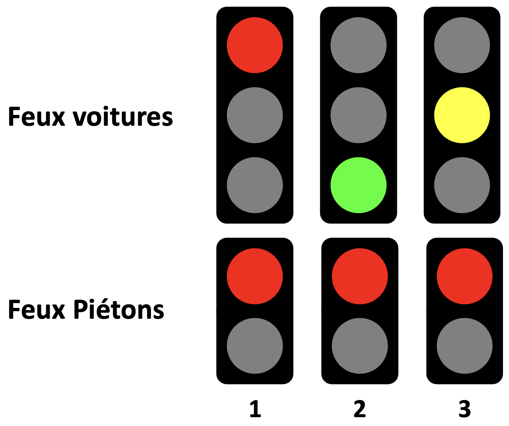
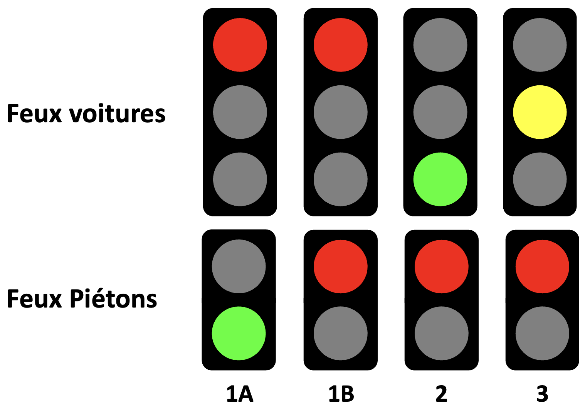

# 420-W48-SF-TP01

## 1 - Directives

### 1.1 - Déroulement du TP

- Remise du travail: mercredi 7 janvier 2026, 23:59
- Ce travail est réalisé en équipe de 2 membres et seuls les membres de cette équipe y contribuent
- Vous devez utiliser votre dépôt Git pour faire votre travail : si une situation particulière est détectée, vos commits moduleront votre note dans le groupe
- Il en va de même pour le fichier Word contenant le rapport final du TP. Il doit être édité en collaboration via Sharepoint/Teams pour que l'historique des modifications puisse être consulté.
- Toutes les réponses fournies doivent être originales (produites par l’étudiant ou un membre de l’équipe)
- Toute copie de code, de portion de code, d’algorithme ou de texte doit faire mention de sa source
- L’emprunt ou la copie de code ou de portions de code est interdite
- L'utilisation de l'IA est considérée comme du plagiat si non documentée en tant que source
- Tout code copié mais documenté comme provenant d'une autre source sera noté à 0 mais ne sera pas considéré comme du plagiat
- Tout constat de plagiat, tricherie ou fraude sera automatiquement déclaré à la Direction et les sanctions prévues seront appliquées

### 1.2 - À remettre sur la plateforme d'enseignement Léa

- Un document word contenant le détail du projet. Ce document doit être édité en collaboration via Sharepoint/Teams. Le document de base doit être celui déjà contenu dans votre canal Teams/Sharepoint nommé `Dossier_TP01.docx`. Une pénalité de 10 points sera appliquée si ce n'est pas respecté.
- Le registre des heures consacrées au projet, inclus dans le document word (avec les totaux par participant)
- Votre code source C++ avec la structure de PlatformIO
- Vous devez fournir le lien d'une vidéo de 5 minutes illustrant le circuit, le code et le fonctionnement :
  - La vidéo doit être déposée sur YouTube
  - En lien non listé
  - La vidéo doit être accessible jusqu'à un an après la remise du travail
  - La vidéo doit être en français

### 1.3 - Structure de la remise

- Vous devez remplir le fichier "AUTHORS.md" qui donne le nom et matricule des équipiers
- Votre code source doit être dans le répertoire  ```src``` du présent dépôt Git
- Le répertoire source doit suivre la structure d’un projet PlatformIO
- Le lien de la vidéo doit être indiqué dans le document word et dans le fichier "AUTHORS.md"
- Le répertoire ```documents``` doit contenir votre rapport final de TP

## 2 - Description du projet

La municipalité de « LongueVie » désire mettre en place un système de signalisation par feux de circulation. De nombreuses collisions entre véhicules et accidents impliquant des piétons blessés gravement sont survenus depuis l’élargissement de la chaussée à quatre voies.

Le « directeur de la sécurité routière de la municipalité »  vous a donc octroyé un mandat pour mettre en place un système de gestion des feux de circulation en remplacement des panneaux d’arrêt.

Votre tâche générale consiste à mettre en place un programme de gestion du contrôle de la circulation.

Ce système comprend :

- Un « feu de circulation automobile » (ci-après nommé FeuAutos) composé de 3 DELs (une rouge, une jaune et une verte) pour les véhicules automobiles
- Un « feu de piétons » (ci-après nommé FeuPiétons) composé de 2 DELs (une rouge et une verte). Le FeuPiétons est commandé par des boutons placés de chaque côté de la chaussée
- Un microcontrôleur Arduino UNO et une carte de circuit électronique contenant les composants pour le bon fonctionnement du système
- Un document technique
- Deux boutons poussoirs pour les appels piétons
- Un potentiomètre pour sélectionner le mode de fonctionnement des feux de circulation
- Un système de persistance des données pour conserver les statistiques entre les redémarrages
- Un système d'affichage des statistiques
- Un système de réinitialisation des statistiques

### 2.1 - Mise en place des feux de circulation

Les feux de circulation peuvent fonctionner suivant trois modes : régulier, urgence et entretien.

Le mode est défini par la position du potentiomètre :

- Lorsque la position du potentiomètre se situe entre les valeurs 350 et 750 de l'ADC, le système fonctionne en mode régulier,
- Lorsque la position du potentiomètre est supérieure à 750 de l'ADC, le système passe en mode urgence,
- Lorsque la position du potentiomètre est inférieure à 350 de l'ADC, le système passe en mode entretien.
- Le système doit constamment surveiller la position du potentiomètre pour détecter les changements de mode et réagir en conséquence.
- Il faut tenir compte de l'hystérésis pour éviter les changements de mode fréquents lorsque le potentiomètre est proche des seuils. Une marge de ±10 unités ADC doit être appliquée autour des seuils pour stabiliser la détection des modes.

#### 2.1.1 - Mode régulier (Séquence normale)

FeuAutos utilise le cycle rouge (1), vert (2) et jaune (3) :



Quand un piéton appuie sur le bouton d'appel, sa demande est mémorisée dans le système. Quand le feu passe au rouge, on vérifie si une demande est en cours. Si c'est le cas, on passe FeuPiétons au vert pendant une certaine durée déterminée (1A). Le feu piéton passe ensuite au rouge pendant une autre durée déterminée (1B) et le cycle des feux automobile recommence (2, 3) :



On voit ici que l’état 1 du cycle sans piéton a été transformé en deux états 1A et 1B.

Lorsque le piéton demande un droit de passage (appuie sur un des deux boutons), le cycle auto doit se poursuivre jusqu'au prochain passage au rouge (état 1) avant de passer au cycle piéton (1A-1B-2-3).

**Note importante** : Si un piéton appuie sur le bouton alors qu'un cycle piéton est déjà en cours ou vient de se terminer, la demande doit être ignorée pour éviter les cycles piétons consécutifs. Une nouvelle demande ne peut être prise en compte qu'une fois le cycle automobile débute (états 2-3).

Pour les besoins de la simulation, les temps choisis sont :

| État | Durée (sec.) | FeuAutos | FeuPiétons |
| --- | --- | --- | --- |
| 1 | 15 | Rouge | Rouge |
| 1A | 20 | Rouge | Vert |
| 1B | 10 | Rouge | Rouge |
| 2 | 30 | Vert | Rouge |
| 3 | 5 | Jaune | Rouge |

#### 2.1.2 - Mode urgence

En mode urgence, tous les feux doivent être au rouge pour céder le passage aux véhicules d'urgence.

**Transition** : Lorsque le potentiomètre passe en mode urgence, le système doit immédiatement passer tous les feux au rouge, interrompant le cycle en cours si nécessaire. Au retour en mode régulier, le système reprend un nouveau cycle automobile (état 1).

#### 2.1.3 - Mode entretien

En mode entretien, tous les feux (FeuAutos et FeuPiétons) doivent clignoter rouge de façon synchrone à une fréquence de 1 Hz (allumé 500ms, éteint 500ms) pour signaler les travaux d'entretien et de réparation de la chaussée.

**Transition** : Lorsque le potentiomètre passe en mode entretien, le système doit immédiatement activer le clignotement, interrompant le cycle en cours. Au retour en mode régulier, le système reprend un nouveau cycle automobile (état 1).

#### 2.1.4 - Démo

[](https://youtu.be/8aGVZ9gCH-c)

### 2.2 - Analyse statistique

La municipalité veut connaître l'achalandage des piétons dans les rues et propose comme première approche de pouvoir afficher le pourcentage du nombre de cycles piétons par rapport au nombre de cycles automobiles. Un cycle piéton est compté au début du cycle piéton, un cycle auto est compté au début du cycle auto.

Le calcul du pourcentage est défini comme le ratio entre le nombre total de cycles piétons par rapport au nombre total de cycles auto, traduit en pourcentage. Par exemple, 10% indique que sur 100 cycles autos, il y a eu 10 cycles piétons.

Ce pourcentage ne doit pas être réinitialisé à chaque redémarrage du système de contrôle de l'artère de circulation.

Dans votre document d'analyse, vous devez expliquer comment vous vous y prenez pour résoudre ce problème et vous devez aussi expliquer quelles sont les limites de votre système (Valeurs maximales, précision, intégrité des données, etc.). Combien de temps peut durer le système avant que les statistiques ne deviennent invalides ? (On se base sur 50000 cycles d'écriture par cellule maximum pour la mémoire EEPROM de l'Arduino UNO).

Vous devez trouver un moyen d'afficher facilement le pourcentage au démarrage du système et sur demande. Vous devez également trouver un moyen de réinitialiser le pourcentage à 0.

**Suggestions d'affichage** : Vous pouvez utiliser le port série (moniteur série). Vous pouvez également utiliser un bouton supplémentaire pour afficher les statistiques sur demande, ou une commande série. Justifiez votre choix dans le document d'analyse.

## 3 - Détail de l'évaluation

### 3.1 - Répartition des points

Vous pourrez faire le travail en équipe de 2 personnes, au maximum. Cette règle pourra être modifiée sur accord avec les formateurs. Dans ce dernier cas, le document doit indiquer les tâches respectives que chaque personne aura faites.

1. Document de présentation du projet : 40% au total
   - Page de présentation (titre, auteurs, date, standard Cégep) et structure document : 2%
   - Contexte du projet (3%)
   - Planification, attribution des tâches (2%)
   - Schéma du circuit électronique (5%)
   - Dessin de montage sur plaque de circuit (5%)
   - Diagramme de classes UML (5%)
   - Inventaire des pièces avec estimation des coûts (3%)
   - Estimation énergétique : durée de vie des batteries / consommation si sur secteur (2%)
   - Estimation du courant utilisé par I/O et validation de la capacité du MCU (2%)
   - Explication de la méthode de persistance des données statistiques et calcul des limites (5%)
   - Explication de la méthode d'affichage et de réinitialisation des statistiques (3%)
   - Devis de tests manuels (3%)

2. Vidéo de présentation : 10% au total
   - Explication du schéma et du montage (2%)
     - Présentation du circuit
     - Présentation du montage sur plaque de circuit
   - Explication globale du code (4%)
     - Gestion des modes et transitions
     - Gestion des cycles de feux
     - Gestion des appels piétons
     - Persistance des données
     - Affichage des statistiques
   - Démonstration du fonctionnement des 3 modes (2%)
     - Mode régulier avec et sans appel piéton
     - Mode urgence
     - Mode entretien
   - Statistiques (redémarrage, affichage et réinitialisation) (2%)

3. Registre des heures consacrées au projet : 5%

Le registre contient la liste des activités et le temps consacré à chaque activité, identifiées par participant concerné. Format suggéré : tableau avec colonnes (Date, Participant, Activité, Durée). Le total des heures doit être indiqué pour chaque participant.

4. Code : 45% au total
   - Cycle régulier automobile (états 1, 2, 3) : 7%
   - Cycle piéton (états 1A, 1B) avec gestion des appels : 7%
   - Mode urgence (transition et fonctionnement) : 4%
   - Mode entretien (transition et fonctionnement) : 4%
   - Gestion du potentiomètre et changement de modes : 3%
   - Analyse statistique (comptage, calcul, affichage, réinitilisation) : 3%
   - Persistance des données (sauvegarde/restauration) : 7%
   - Qualité du code (structure, POO, commentaires, normes) : 10%

Toute utilisation de la fonction delay() entraîne un zéro à la fonctionnalité concernée.

### 3.2 - Critères appliqués durant l'évaluation

L'évaluation du travail est effectuée par le(s) enseignant(s) de l'UE en se basant sur :

- L'historique de Git et de Teams/Sharepoint font office de référence pour évaluer la proportion du travail effectué par chaque équipier

- La qualité et le contenu du code source :

  - Conformité du code et des normes d'écriture utilisées dans le cours
  - Respect des bonnes pratiques de programmation
  - Fonctionnalité du code (tous les modes fonctionnent correctement)
  - Facilité de lecture du code (noms explicites, structure claire du code et des fichiers)
  - Modularité et utilisation adéquate de la POO (classes, encapsulation, héritage si approprié)
  - Qualité du modèle objet (responsabilités claires, couplage faible)
  - Paramétrisation du code (constantes pour les temps, pins, seuils)
  - Utilisation de constantes (pas de nombres magiques)
  - Gestion appropriée de la mémoire (pas de fuites, optimisation pour Arduino)
  - Bonne utilisation des contraintes matérielles
  - Bonne utilisation des bibliothèques (PlatformIO, Arduino)
  - Gestion des états et transitions
  - Robustesse du code (gestion des cas limites)

- La qualité et le contenu du document word :
  
  - Qualité du français (orthographe, grammaire, syntaxe, vocabulaire technique)
  - Schéma électrique (clarté, précision, légende, respect des normes)
  - Diagramme de classes UML (complétude, clarté, respect de la notation UML)
  - Clarté et précision des explications techniques
  - Explication détaillée de la gestion des modes et transitions
  - Explication de la méthode de persistance des données
  - Explication de la méthode d'affichage des statistiques
  - Analyse des limites du système
  - Mise en page professionnelle (structure, hiérarchie, lisibilité)
  - Page de présentation complète (titre, auteurs, date, contexte)

- La qualité et le contenu de la présentation vidéo :

  - Qualité de l'image (résolution, stabilité, cadrage)
  - Qualité audio (clarté, volume, absence de bruits parasites)
  - Clarté des explications orales (français correct, débit adapté, vocabulaire technique)
  - Démonstration complète des trois modes (régulier, urgence, entretien)
  - Démonstration du cycle piéton avec appel
  - Démonstration des statistiques (affichage et réinitialisation)
  - Respect de la durée (~5 minutes, 10 minutes maximum)

- Participation au code : la participation est évaluée en utilisant GitInspector. Chaque étudiant doit être au dessus de 45% de participation ou verra sa note ajustée. Les codes faits en classe lors des exercices sont enlevés des statistiques pour ne pas pénaliser le partenaire qui ne met pas son ancien code. (Ex. Bouton.\[h|cpp], DEL.\[h|cpp], etc.)
- L'évaluation tient compte :
  - du style et de la structure du code : elle doit être similaire à celle proposée en cours
  - des pratiques de programmation apprises dans le programme doivent être appliquées
  - de la participation de chaque coéquipier avec la formule suivante : $ Min(100, note*50% + note*Min(50%, %participation))$, soit 50% de la note globale + %participation plafonné à 50% de la note globale. (Ex. note globale 110% et participation 50/50 : donne 100% à chaque personne, note globale 90 et participation 70/30 note : 90 et 72)
  - la participation est évaluée par les commits sur Git. Si une manipulation de l'historique est détectée, l'équipe sera pénalisée avec une participation maximale de 40% par partenaire. (Venir voir l'enseignant dès que détecté avant de tomber sur un problème au moment de la correction !). Actuellement, GitInspector est utilisé pour évaluer cette participation

Tout partage de code, d'explications, de bouts de texte, etc. est considéré comme du plagiat. Pour plus de détails, consultez le site (et ses vidéos) [Sois intègre du Cégep de Sainte-Foy](http://csfoy.ca/soisintegre) ainsi que [l'article 6.1.12 de la PÉA](https://www.csfoy.ca/fileadmin/documents/notre_cegep/politiques_et_reglements/5.9_PolitiqueEvaluationApprentissages_2019.pdf)

Si vous utilisez un code donné en cours, n'oubliez pas de référencer son origine dans votre code.

## 4 - Matériel dans l’inventaire de l’entreprise

Le budget se limite au matériel. Le temps alloué et le temps de montage sur plaque de circuit est exclus. Tous les prix sont fictifs.

Ajoutez des éléments et des prix au besoin (prix fictifs)

| Composant | Description | Nombre / lot | Prix ($ CAD)(*) |
| --- | --- | --- | --- |
| Arduino UNO | Microcontrôleur | 1 | 25,00 $ |
| DEL rouge 5mm | Haute luminosité | 1 | 0,10 $ |
| DEL jaune 5mm | Haute luminosité | 1 | 0,10 $ |
| DEL verte 5mm | Haute luminosité | 1 | 0,10 $ |
| Bouton poussoir | Normalement ouvert, momentané | 1 | 0,50 $ |
| Potentiomètre | 10 kΩ, rotatif | 1 | 0,75 $ |
| Résistance ¼ W | Jusqu’à 999 Ω | 4 | 0,15 $ |
| Résistance ½ W | Jusqu’à 999 Ω | 4 | 0,25 $ |
| Résistance ¼ W | > 999 Ω | 4 | 0,35 $ |
| Résistance variable | Toutes valeurs | 1 | 0,25 $ |
| Fils cavaliers | Longueur/couleur variées | 4 | 0,05 $ |
| Natte Dupont | Mâle-Mâle | 4 | 0,15 $ |
| Natte Dupont | Mâle-Femelle | 4 | 0,15 $ |
| Natte Dupont | Femelle-Femelle | 4 | 0,15 $ |
| Plaquette pour soudure | Fabriquée selon schéma fourni | 1 | 5,00 $ |
| Afficheur Volt/Ampère | 0-99 V /0-2 A | 1 | 15,00$ |
| Alimentation 9V | Adaptateur secteur 1A | 1 | 5,00 $ |

(*) Tableau fictif, à des fins pédagogiques seulement

## 5 - Références

Il est conseillé d'utiliser les bibliothèques du cours suivantes :

- [Utilify](https://registry.platformio.org/libraries/sirdrako/Utilify) : Bibliothèque utilitaire pour Arduino et PlatformIO
- [UtilifyDigitalInput](https://registry.platformio.org/libraries/sirdrako/UtilifyDigitalInput) : Gestion des entrées numériques avec anti-rebond
- [UtilifyEEPROM](https://registry.platformio.org/libraries/sirdrako/UtilifyEEPROM) : Gestion simplifiée de la mémoire EEPROM (N'oubliez pas de définir `#define OVERRIDE_EEPROM_MAX_WRITES_PER_BLOCK 2` à une valeur appropriée dans votre code avant d'inclure la bibliothèque)
- [UtilifyLogger](https://registry.platformio.org/libraries/sirdrako/UtilifyLogger) : Journalisation des événements pour Arduino
- [UtilifyAnalogInput](https://registry.platformio.org/libraries/sirdrako/UtilifyAnalogInput) : Gestion des entrées analogiques avec filtrage (Joystick, potentiomètre, etc.)


